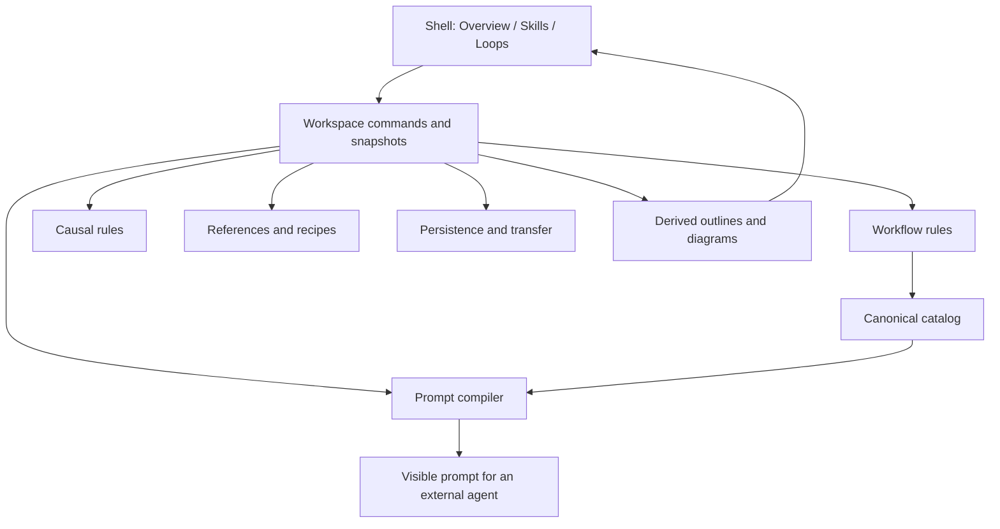

# Composer architecture: one workspace for reasoning and work

Status: reviewed design, implementation not started. Architect run: `20261003T060805Z-unified-mobile-composer-a98ff859`.

## Product decision

Build one offline workspace with **Overview, Skills, and Loops** views. Overview connects the question being explored, causal hypotheses, and the work addressing them. Skills remains a complete workflow composer; Loops remains a complete causal-map editor. Each view also has a readable outline; diagrams are optional editing and exploration surfaces.

Treat a **composite** as a reusable workflow recipe: a named snapshot of canonical skill invocations, inserted as ordinary editable steps. It does not create or install a canonical skill. This is the working interpretation of “composite agent skills”; authoring installable composites would require a separate skills-management design.

Begin with one workflow and one causal map per workspace, either of which can be absent. Support several workspaces through portable JSON rather than starting with a multi-document notebook manager. Keep the seven canonical skills and their host execution contracts.

## Requirements and acceptance

- Combine reasoning and action through explicit references and a useful Overview; retain independent skill and loop editing, import, and export.
- Make phones complete authoring devices. Adding, connecting, editing, reusing, inspecting feedback, recovering, and exporting must require no drag, pan, zoom, or hover.
- Retain direct-file, offline, standalone HTML distribution and existing drafts. Python remains an authoring dependency only.
- Preserve user instructions, model overrides, handoffs, signs, delays, groups, and layouts during migration.
- Preserve explicit external agent execution, bounded delegation, unique artifacts, evidence handoffs, and live project reconciliation.
- Keep causal feedback cycles separate from execution dependencies. R/B classification is a structural observation about declared signs, not a forecast or simulation.

Non-goals for this redesign: a browser agent runtime, numerical simulation, automatic causal inference, executable cyclic workflows, recursive recipe calls, collaboration servers, automatic GitHub publishing, and automatic canonical skill installation.

## Why the current boundaries need work

The current HTML contains two separately bootstrapped applications. The skill closure owns its graph, validation, interaction, prompt generation, and `orch.skill-composer.v1` draft. The appended loop closure owns another graph, interactions, cycle analysis, and `orch.loop-map.v1` draft. Both write the same JSON export dialog; their global event handling is coordinated through a body CSS class.

The workflow topological sorter breaks ties using diagram coordinates. Moving independent steps can change exported execution order. Causal analysis recomputes during drawing and editor rendering, including changes unrelated to topology. The loop SVG has a 700-pixel minimum width and its phone editor follows the diagram. These are concrete reasons to separate semantics, projections, transfer, and interaction.

Source anchors: [workflow model](../../composer/index.html:129), [validation](../../composer/index.html:139), [mobile interaction](../../composer/index.html:294), [prompt compiler](../../composer/index.html:336), [loop UI](../../composer/index.html:382), [causal model](../../composer/index.html:397), [cycle analysis](../../composer/index.html:407), [shared dialog use](../../composer/index.html:423), [builder](../../scripts/build_composer.py:20), and [catalog manager](../../scripts/skills.py:54). Line locations describe the inspected source version.

## Ideal boundaries

| Boundary | Owns | Must not own |
| --- | --- | --- |
| Skill catalog | Canonical names, paths, descriptions, defaults, presentation, snapshot provenance | User recipes, draft changes, live model availability |
| Workflow domain | Skill steps, handoffs, explicit ready-step ordering, output validation, readiness | Causal links, diagram coordinates, browser storage |
| Causal domain | Variables, signed/delayed links, groups, bounded cycle classification | Invocation order, artifact dependencies, simulation |
| Recipes | Frozen workflow fragments, capture and atomic insertion with fresh IDs/outputs | Canonical registration, runtime nesting, automatic updates |
| Context references | Step-to-variable associations, rationale, selected analytical context | Handoffs, inferred causality, execution authorization |
| Workspace store | Sole document owner, validated commands, revision, undo/redo, cross-domain integrity | DOM, file dialogs, localStorage mechanics |
| Persistence and transfer | Version decoding, migration, protected originals, storage status, JSON/SVG/text adapters | Domain policies, implicit execution, silent data loss |
| Prompt compiler | Validated execution plan, frozen optional context, readable agent prompt | Saving drafts, model calls, deriving execution from loops |
| Shell and views | Navigation, forms, outlines, diagrams, focus, transient gestures, shared visual system | Direct semantic mutation, second copies of documents |
| Authoring build | Canonical validation, source fingerprint, deterministic standalone artifact | Runtime dependencies, browser-local user data |

These are ownership boundaries, not a requirement for ten packages. Start with named modules/closures under one bootstrap. Keep pure domain functions separate from adapters and UI. Separate authoring files when the sections become difficult to maintain; the build must inline their contents into one HTML with no file imports, network resources, or service requirement. If the builder evolves beyond packet replacement, fingerprint every source input and validate the final artifact; preserve the existing stdlib catalog validation.



## Core contracts

The notation expresses JavaScript contracts; it does not require TypeScript or a framework.

```ts
type Workspace = {
  format: "orch-workspace"; version: 2; id: string; revision: number;
  name: string; brief: string; lastWriter: string; // local session identifier
  workflow: Workflow | null;
  concepts: ConceptMap | null;
  references: ContextReference[];
  recipes: Recipe[];
  layout: Layout;
};

type SkillStep = {
  id: string; skill: string; label: string; instructions: string;
  output: string; model: string; effort: string;
  options: Record<string, unknown>; // JSON-only; unknown semantics block compile
};
type Variable = { id: string; label: string; note: string; group: string; color: string };
type Workflow = {
  name: string; goal: string;
  steps: SkillStep[];
  handoffs: { id: string; from: string; to: string }[];
  readyOrder: string[];     // permutation of all step IDs; layout independent
};

type ConceptMap = {
  name: string;
  variables: Variable[];   // stable ID, label, note, group, color
  links: {
    id: string; from: string; to: string;
    sign: 1 | -1; delayed: boolean; label: string;
  }[];
};

type ContextReference = {
  id: string; stepId: string; variableId: string;
  purpose: string; includeInPrompt: boolean;
};

type Recipe = {
  id: string; revision: number; name: string;
  fragment: Workflow;      // self-contained copied leaves, no recipe calls
};

type Layout = {
  steps: Record<string, { x: number; y: number }>;
  variables: Record<string, { x: number; y: number }>;
  links: Record<string, { bend: number }>;
};

dispatch(command): { ok: true; revision: number } | { ok: false; issues: Issue[] };
snapshot(): Workspace;
analyzeConcepts(map): { cycles: Cycle[]; coverage: "complete" | "partial" };
previewRecipeInsert(workflow, recipe, outputPrefix): InsertPreview;
compilePrompt(snapshot, catalog): { plan: ExecutionPlan; text: string } | Issues;
```

The store is the single writer. An action produces a candidate change, validates domain and reference invariants, commits one snapshot, records undo, notifies views, and schedules persistence. Failed actions leave the prior snapshot intact. Renderers consume snapshots and selectors; drag previews and incomplete form text live in transient UI state. Every accepted semantic or layout command increments revision; lastWriter records the session that saved the snapshot, without implying identity or locking. readyOrder must contain every step exactly once. Missing imported layout entries receive deterministic default positions; malformed supplied coordinates are diagnosed, and original input remains recoverable.

A handoff is executable dependency data. A causal link is a user hypothesis about directional influence. A reference records why work concerns a variable. Keep separate fields, validators, visual treatments, and relation forms. No generic “connect anything” operation converts one into another.

Derived orders, cycle labels, and Overview cards are never separately saved as semantic truth. Reference stable variables initially, not generated labels such as R1/B2. A cycle's member path remains inspectable; cycles can change after edits. Recompute classification when topology or polarity changes, and carry the partial-coverage flag into every view/export that shows results.

Structural validation covers schemas, ID uniqueness, endpoint kinds, readyOrder, DAG integrity and bounded data. Malformed structures fail import; connection commands introducing a DAG cycle fail atomically. Execution-readiness validation covers the goal, instructions, skill availability, options, models/efforts, output paths and How extensions. Incomplete or invalid executable fields may be saved for repair, but block prompt generation. Recipe insertion additionally refuses output conflicts or limit violations before committing. Preserve unsupported fields in recoverable source data; never silently erase instructions or pretend unknown semantics can execute.

## Composite recipes

Saving selected steps captures their internal handoffs. Show excluded external connections in the preview. Insertions allocate new step/edge IDs, namespace output paths, preserve How's HTML extension, and validate total graph limits, DAG integrity, reserved paths, and path ancestry conflicts against the destination.

Insertion is one undoable transaction. The copied leaves remain authoritative and independently editable. Source recipe edits never update previous uses. Grouping and source revision are optional lineage metadata, not an executable group node or synthetic artifact. Caller handoffs attach explicitly to real steps after insertion; do not guess a single entry/output for a branching fragment.

Recipes appear under **Reusable workflows** alongside, but visibly distinct from, canonical skills. Catalog registration and discovery continue through `skills/` and the existing manager.

## Combined caller experience

Example: investigate why more context sometimes reduces resolved tasks.

1. In Loops, create Context use → Resolved tasks with a negative effect and an explanatory note. Inspect the complete cycle path in the list.
2. In Skills, insert Recall → Arena → Interrogate and edit the concrete goal.
3. Link Arena to Context use with “Investigate context-budget alternatives.” Link Interrogate to Resolved tasks with “Review proposed changes.”
4. Overview shows each hypothesis, associated work, missing associations, and workflow readiness. Selecting a card opens either individual view at its matching item.
5. Preview the exact analytical excerpt to include in the prompt, then export the executable workflow.
6. The external agent produces artifacts. The person may add evidence notes and revise the causal assertions. There is no automatic feedback execution.

References are navigational by default. Including analytical context is explicit, bounded, labeled as hypothesis, and frozen when the prompt preview is generated. Changes after preview mark it stale and offer regeneration. The compiler orders only skill handoffs and ready-order preferences. It retains fresh run directories, actual upstream evidence, per-skill instructions, configured/host limits, and live snapshot reconciliation.

Each operation remains within the user's request. An explicit local-depot save can commit and push locally under its skill; merely linking or inserting that skill does not authorize a save. Context notes and causal cycles do not extend authorization.

## UI overhaul and mobile contract

Use one visual system: consistent typography, spacing, surfaces, selected states, controls, and save/error language. Preserve the useful grouped regions, signed arrows, delayed effects, and loop-path legibility from `loop.png` and `loop2.png`. Theme is a shell choice rather than an abrupt domain-dependent switch.

The phone default is a vertical outline. Skills shows steps, prerequisites, outputs, readiness, and reusable groups. Loops shows variables, relations, and expandable cycle paths. Overview shows the shared brief and related concepts/work with useful empty states. Diagram mode is optional in each individual view; an integrated mixed canvas is deferred until readable linked cards demonstrate a need.

Use a compact workspace header with always-visible save state, three primary destinations, and a context-specific Add action. Detail editing opens one full-height screen/sheet with Back/Done, predictable focus return, and keyboard-aware scrolling. Secondary transfer actions belong to one menu; every export uses one dialog owner with explicit title, filename, content type, and fallback text.

All connections are possible through labeled source/target forms. Layout drag never silently creates a semantic relation in the redesigned UI. Provide non-drag duplicate/delete, recipe insertion, order changes, link removal, and layout reset. Use at least 44 CSS-pixel targets, 16-pixel form text, safe-area spacing, reduced motion, visible focus, textual +/− and delay markers, accessible lists, inline errors, and an issue summary. Desktop adds panes and canvas space to the same complete editing flows.

## Persistence and compatibility

Keep the legacy keys `orch.skill-composer.v1` and `orch.loop-map.v1` untouched. Read a new versioned workspace first; otherwise parse the legacy keys independently and offer an in-memory migration preview. Do not write on startup or infer references from matching labels. Valid data from one domain can open while corrupt data from the other remains protected and exportable.

Initialize ready-order preferences from the legacy coordinate-based topological result so the first migrated prompt retains its order. Preserve semantic fields exactly and move coordinates/bends into layout. Retain original titles and workflow goal; a workspace brief does not overwrite them.

Normal saves persist one validated envelope, keep one last-good snapshot, and visibly report failures. Browser multi-key writes are not a transaction. Preserve exact corrupt/future-version bytes and never replace them through ordinary autosave. Best-effort stored-revision conflict checks pause overwrites from another window and offer export/reload; collaborative merging is deferred.

Retain legacy domain imports/exports through adapters. Individual import replacement affects only that domain, previews affected references, and requires explicit repair/removal decisions. Deleting a concept never deletes linked work; deletion previews affected associations and is undoable. Full workspace JSON retains references, recipes, and layout. Legacy exports explain omitted metadata and order semantics; legacy workflow ordering can still depend on its receiving editor's coordinates, so version-2 workspace export is the authoritative round trip for explicit ready order. Invalid imports leave active state intact.

Preserve the current per-domain bounds of 100 steps/300 handoffs and 60 variables/150 causal links. For the initial version, accept a workspace up to **8 MiB of UTF-8 JSON**, **300 references** with purposes up to **2,000 characters**, and **20 recipes** with at most **400 stored recipe steps / 1,200 internal handoffs in total**. Each recipe also follows the existing workflow graph bounds. Retain existing legacy field limits when decoding; normal editors can guide users toward shorter labels without truncating imported text. Prompt analytical context is limited to **20,000 characters**, with a visible subset-selection preview. Over-limit inserts/imports are rejected without mutation; oversized legacy originals remain raw-exportable and may be opened individually under their legacy rules rather than silently truncated into v2. These are explicit starting policies, not measured browser performance guarantees; an 8 MiB valid document may still exceed browser storage quota. Browser-local storage remains a convenience; portable JSON is the user's durable transfer artifact.

## Delivery sequence and proposed verification

| Phase | Deliverable | Evidence needed before moving on |
| --- | --- | --- |
| 1 | Pure domain adapters, one state/export owner, stable semantic ordering | Existing imports/prompts preserved; diagram movement does not change ordering |
| 2 | Versioned workspace, independent legacy migration and recovery | Both original drafts recoverable; failed storage/import cannot erase them |
| 3 | Shared shell, complete phone outlines/editors, preserved individual diagrams | Add/edit/connect/export both domains without drag, pan, or zoom |
| 4 | Overview references and bounded context preview | Associations never create handoffs; stale previews are visible |
| 5 | Snapshot recipes and polished diagrams | Repeated insertion has no ID/output collisions; branching stays explicit |

When implementation verification is requested, cover DAG cycle rejection, multi-input/fan-out order, negative-sign parity, delays, partial cycle coverage, retired skills, reserved/conflicting outputs, recipe remapping/caps, protected drafts, future versions, interrupted/quota-failed saves, two-window conflicts, clipboard/download fallback, and legacy/full-workspace transfers.

Exercise direct-file offline use at 320/390/768-pixel widths, landscape, virtual keyboard open, keyboard-only navigation, focus return, and screen-reader flows. Run canonical/build checks separately; they do not establish usability.

## Decision record and limits

The comparison, selected base, grafts, and rejected ideas are recorded in [the architecture comparison](composer-comparison.md). Original candidates, judge, source hashes, and run manifest remain under `.orch/runs/20261003T060805Z-unified-mobile-composer-a98ff859/`.

This architect pass inspected repository source and the two image references. No UI implementation, tests, browser/device verification, commits, or pushes were performed. Historical checks in repository documentation were not rerun. Composite semantics and aggregate storage/import limits remain explicitly stated assumptions or implementation decisions.
